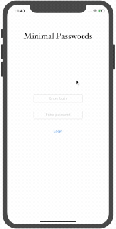
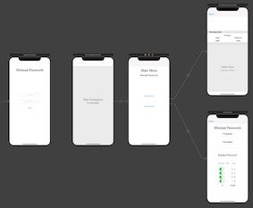

# MinimalPasswords
 An iOS app designed to produce safe passwords with a minimal UI.
 
 This project uses Swift, Objective-C, and SQLite. It also incorporates CocoaPods.

## Demonstration of MinimalPasswords

## Explanation of Storyboard
There are four (4) ViewControllers. This includes a login screen, a screen containing a menu of options, a password generator screen, and a password list screen. Altogether, they make up the storyboard:

## Options for Passwords
In the password generator viewcontroller, there are 5 different parameters for generating passwords. These include: uppercase and lowercase letters, numbers, special symbols, and length of password. 
